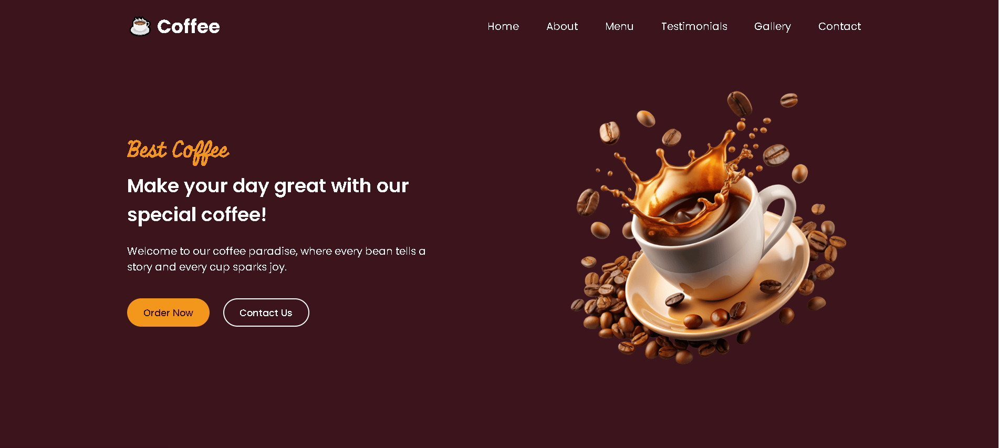

# ☕ CoffeeShop Landing Page

A modern, responsive **Coffee Shop Landing Page** created as part of my portfolio projects.  
The website is designed to showcase an elegant UI for a coffee shop, featuring smooth navigation, menu highlights, and engaging visuals.  

---

## 🔥 Live Demo
[View Project](https://salilbhojankar1.github.io/CoffeeShop/)  

---

## 📸 Screenshots

### Homepage Preview
  

---

## 🛠️ Tech Stack

- **HTML5** – Semantic structure  
- **CSS3** – Styling and responsiveness  
- **JavaScript** – Interactive elements (toggle menus, effects)  

---

## 🎯 Features

- ✅ Fully responsive design (mobile, tablet, desktop)  
- ✅ Hero banner with coffee theme  
- ✅ Navigation menu  
- ✅ Menu section to highlight coffee items  
- ✅ Smooth scroll and animations  
- ✅ Easy-to-customize design  

---

## 📂 Project Structure
CoffeeShop/
│
├── index.html # Main landing page
├── style.css # Stylesheet
├── script.js # JavaScript interactivity
├── images/ # Assets (coffee images, backgrounds, icons)
└── README.md # Project documentation

---

## 🚀 Getting Started

1. Clone the repository:
   ```bash
   git clone https://github.com/salilbhojankar1/CoffeeShop.git


---

## 👨‍💻 Author

Salil Bhojankar

Portfolio: salilbhojankar1.github.io

GitHub: @salilbhojankar1

LinkedIn: [(Salil Bhojabkar)](https://www.linkedin.com/in/salil-bhojankar-ab12ab238)

---

## 📜 License

This project is licensed under the MIT License – free to use, modify, and share.
